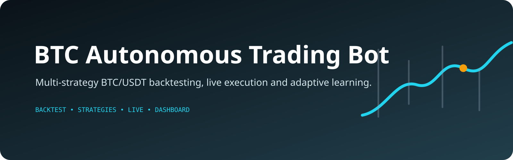

<p align="center">
  
</p>

# BTC Paper Trading Bot (educational)

Multi-strategy BTC/USDT **paper-trading** bot on real Binance Spot prices, with a
startup backtest, safe self-learning against frozen baselines, and a Dash dashboard.
Educational project: it does not prove profitability and must not trade real money.

---

## Features

| Feature | Detail |
|---|---|
| Market data | Real Binance public REST API (no keys). **No simulated-data fallback**: without Binance access the bot exits. |
| Execution | Paper trading at live prices (fee 0.1% + slippage 0.03%) |
| Strategies | 8 registered strategies on 1d / 4h candles (see below) |
| Backtest | 500 days of real candles at startup |
| Activation | CAGR ≥ 30%, win rate ≥ 38%, profit factor ≥ 1.2 **and** ≥ `MIN_BACKTEST_TRADES` (30) trades |
| If none pass | **Observation mode** (default) or trade all with `ALLOW_UNVALIDATED_STRATEGIES=true` |
| Self-learning | One small, walk-forward-validated parameter change at a time, audited, with automatic rollback. No LLM. |
| Baseline | Every active strategy has a frozen default-parameter copy trading the same signals |
| Dashboard | Dash app on port 8050 (no login — keep it on localhost) |

---

## Strategies (`strategies/__init__.py → ALL_STRATEGIES`)

| Strategy | Candles | Idea |
|---|---|---|
| EMA5_Momentum | 1d | Close crosses the 5-period EMA |
| DualMA_Crossover | 1d | SMA-100 / SMA-250 golden / death cross |
| Regime_RiskOnOff | 4h | EMA-200 + MACD + RSI must agree |
| PriceMomentum_25 | 1d | 25-day close-to-close momentum |
| Residual_MeanRev | 4h | Z-score of residual vs rolling log-price trend |
| Donchian_Breakout | 1d | 15-day Donchian breakout while ADX is calm |
| Blended_MomentumMR | 4h | 50/50 momentum + RSI/Bollinger mean reversion |
| BTC_MomentumBreakout | 1d | Breakout above 20-day high in a bull regime, volume-confirmed |

### Candidate catalog (`CANDIDATE_STRATEGIES`)

Public, documented trader strategies (each class has a `SOURCE`), added by hand
with tests — the bot never downloads or runs code from the internet:

| Strategy | Candles | Source |
|---|---|---|
| RSI_Bollinger, MACD_Momentum, EMA_Crossover, Breakout | 4h/1h | repo strategies, previously unregistered (repaired) |
| Turtle_Breakout | 1d | Dennis / Faith, *Way of the Turtle* — System 1 |
| Connors_RSI2 | 1d | Connors & Alvarez, *Short Term Trading Strategies That Work* |
| Bollinger_Squeeze | 4h | Bollinger, *Bollinger on Bollinger Bands* — The Squeeze |
| Supertrend | 4h | Supertrend ATR 10 × 3 |
| Golden_Cross_50_200 | 1d | 50/200-day moving-average cross |

`ml_adaptive.py` is not registered (model persistence / training not evaluated).

## Strategy evaluator (`strategy_evaluator.py`)

Every `EVAL_INTERVAL_HOURS` (24) each strategy (registered + catalog) is rated from
a walk-forward backtest on 4 non-overlapping 180-day windows, each trade tagged with
the **market regime** at entry (trending up / trending down / ranging, from ADX and
EMA-50/200) and its **side**, plus its live paper trades in the `lab` book:

| Status | Rule (configurable) | Effect |
|---|---|---|
| ✅ VIABLE | ≥30 trades, PF ≥1.2, profitable in ≥3/4 windows, DD ≤15% | trades in the learning book |
| 🟡 CONDICIONAL | PF ≥1.3 with ≥10 trades in some regime | trades only in those regimes |
| 🔍 EN_PRUEBA | not enough / mixed evidence | lab only |
| ⛔ DESCARTADA | ≥40 trades, PF <0.9, ≤1 profitable window, no working regime (or losing live) | **score 0, never re-evaluated nor traded again** |

A losing side (≥10 trades, PF <0.9) is blocked. Ratings and their history are in
`strategy_status` / `strategy_evaluations` and in the dashboard tab **Estrategias**.

In the last 500-day backtest (Sept 2026) **none of the 8 strategies passed** the
thresholds, so by default the bot runs in observation mode.

---

## Quick start (local)

```bash
cd Claude-trading-bot-main
python3.11 -m venv venv && . venv/bin/activate     # Windows: py -3.11 -m venv venv; venv\Scripts\activate
pip install -r requirements.txt
cp .env.example .env        # safe demo defaults, no API keys
python -m pytest -q         # tests
python run_backtest_only.py # backtest table + backtest_results.html
python main.py              # bot + dashboard at http://localhost:8050
```

All variables are documented in [`.env.example`](.env.example). Keep
`PAPER_TRADING=true`; leave all API keys empty.

If `https://api.binance.com` returns HTTP 451 in your region, set
`BINANCE_PUBLIC_BASE=https://data-api.binance.vision` (official public mirror).

## Server (Docker)

```bash
mkdir -p data models && cp .env.example .env
docker compose up -d --build
docker compose logs --tail 50
```

- The DB (`trading_bot.db` + `-wal`/`-shm`) and `trading_bot.log` live in `./data`
  (`DATA_DIR=/app/data`). Mount the folder, not the single `.db` file.
- The dashboard is published on **127.0.0.1:8050 only** (Docker bypasses ufw and
  the dashboard has no login). View it with an SSH tunnel:
  `ssh -L 8050:localhost:8050 user@server` → http://localhost:8050

---

## Trading modes and paper books

Positions, trades and balances are stored per **book**:

| Book | What it is |
|---|---|
| `main` | What the bot trades (only validated strategies, or all with `ALLOW_UNVALIDATED_STRATEGIES=true`) |
| `observe` | Observation mode: theoretical trades with simulated fills, no orders at all |
| `baseline` | Frozen default-parameter copy of each registered strategy, own virtual capital |
| `lab` | Every non-discarded strategy (registered + catalog) without the evaluator gate: live evidence |

The mode (`TRADE`, `TRADE_UNVALIDATED`, `OBSERVE`) is shown in the dashboard header.
Every processed signal is logged in `signal_log` (acted on or not, and why). A
signal on a closed candle is acted on once per strategy (the loop re-checks every 60 s).

---

## Safe self-learning (`adaptive_tuner.py`)

Each strategy declares its tunable parameters with hard limits
(`TUNABLE_PARAMS = {"ema_period": ParamSpec(min=3, max=12, step=1), ...}`);
nothing else can change. Every `LEARNING_INTERVAL_HOURS` (24), if there are enough
new trades or days of data, for each strategy:

1. Pick ONE tunable (round-robin) and try value ± one step on the **proposal window**
   (180 days ending 180 days ago). The best neighbour must beat the current value.
2. Re-test it on the **validation window** (the last 180 days, not used in step 1).
   Apply only with ≥ 10 trades, profit factor ≥ +5% and > 1, max drawdown at most +2 pts.
3. After 72 h compare the equity change of the learning strategy with its frozen
   baseline; if it lagged by more than 2% of equity, **roll back** automatically.

Limits: 1 change per strategy per day, hard min/max, no new proposal while a change
is under evaluation. Learned values survive restarts. Every proposal (applied /
rejected / rollback, reason, metrics before/after) is stored in `learning_audit` and
shown in the dashboard tab **Aprendizaje**. No LLM or `ANTHROPIC_API_KEY` is involved
(`ANTHROPIC_API_KEY` only rewrites journal reflections, optionally).

Caveat: walk-forward validation on 180 days of 1d candles has few trades; most
proposals are rejected for that reason, and an accepted change can still be overfit.

---

## Risk management (`config.py`)

- Stop-loss / take-profit: ATR-based per strategy (fallback 2.5% / 5.5%)
- Max position size: **35%** of strategy capital (`MAX_POSITION_PCT`)
- Drawdown guard: pauses new entries if a strategy's **equity** (free + committed +
  unrealized) drops 20% from its peak
- Confidence filter: skips trades with ML confidence < 0.40 or signal confidence < 0.42
- Max 2 simultaneous positions per strategy

## Dashboard tabs

Portfolio Overview · Strategy Performance · Open Positions · Trade History ·
Trade Journal · **Aprendizaje** (learner vs baseline, parameters, learning audit) ·
**Estrategias** (evaluator: status, score, profit factor per market regime, reasons, sources)

---

## Disclaimer

Educational software. Backtests and paper results do not guarantee future returns and
short tests (days, few trades) are not statistically meaningful. Never trade with funds
you cannot afford to lose.
